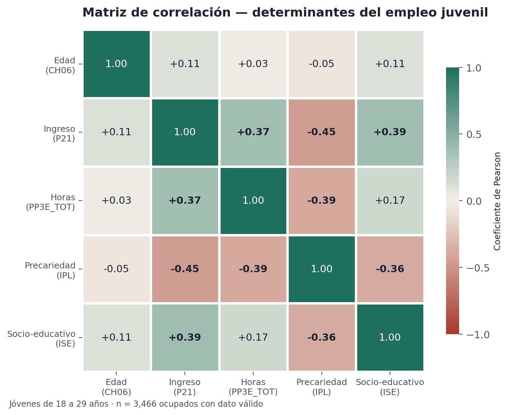
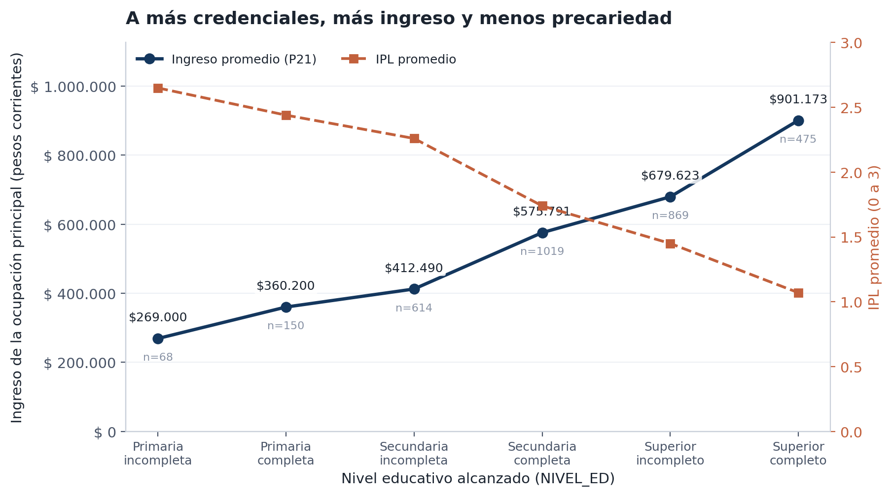

# Análisis del Empleo Juvenil en Argentina — microdatos EPH (INDEC)

> Diagnóstico del mercado laboral de las personas de **18 a 29 años** a partir de microdatos de la
> Encuesta Permanente de Hogares, con **variables compuestas propias**, **matriz de correlación**,
> **dashboard** e **informe ejecutivo en PDF**.

**Autor:** Jeisson Marín Uribe · Analista de Datos
**Herramientas:** Microsoft Excel / Google Sheets (fórmulas vivas) · Python (pandas, openpyxl, matplotlib) · Word/PDF
**Cliente simulado:** Fundación Impacto Laboral (entidad ficticia, caso de estudio)

---

## 1. El problema

El empleo juvenil es una de las variables más sensibles de la economía argentina: alta informalidad,
brecha de género en tareas de cuidado y falta de experiencia previa dificultan el acceso a puestos de calidad.
Los microdatos de la EPH existen, pero llegan en estado nativo: **códigos numéricos abstractos**
(`CH06`, `ESTADO`, `PP07H`, `PP3E_TOT`…) sobre decenas de miles de registros.

La pregunta que guía el proyecto es concreta: **¿qué determina que una persona joven acceda a un empleo de calidad?**

## 2. Qué hace este proyecto

| Etapa | Qué se hizo |
|---|---|
| **1. Extracción y limpieza** | Importación del archivo de personas (delimitado por `;`), filtrado del segmento 18-29 (`CH06`), diagnóstico de nulos y de los códigos especiales del INDEC (`-9`, `999`). |
| **2. Ingeniería de datos** | Construcción de **dos variables compuestas** que la encuesta no trae: **IPL** (Índice de Precariedad Laboral, 0-3) e **ISE** (Índice Socio-Educativo, 0-3), con funciones lógicas anidadas (`SI`, `O`) y decodificación con `BUSCARV`. |
| **3. Análisis estadístico** | Matriz de correlación de Pearson 5×5 (`COEF.DE.CORREL`) con mapa de calor, tabla dinámica de brecha de género por región y perfil ingreso–educación (`PROMEDIO.SI`). |
| **4. Comunicación** | Hoja **DASHBOARD** con KPIs y gráficos, tres visualizaciones exportadas e **informe ejecutivo de 4 páginas** en PDF para perfiles decisores. |

### Las dos métricas propias

**IPL — Índice de Precariedad Laboral (0 a 3).** Suma un punto por cada carencia del puesto:

| Punto | Condición | Variable EPH |
|---|---|---|
| +1 | No le descuentan aportes jubilatorios (informalidad) | `PP07H = 2` |
| +1 | Inestabilidad contractual (temporario / sin relación estable) | `PP07C >= 2` |
| +1 | Jornada atípica: subocupación (<35 h) o sobreocupación (>48 h) | `PP3E_TOT` |

**ISE — Índice Socio-Educativo (0 a 3).** 2 puntos por secundaria completa o más, 1 punto adicional por
estudios superiores (`NIVEL_ED`).

> El IPL queda **en blanco** para quien no está ocupado: `PP07H` y `PP07C` solo se relevan a ocupados y
> asignarles 0 los contaría, erróneamente, como empleo de calidad.

## 3. Hallazgos principales

| Indicador | Valor |
|---|---|
| Jóvenes 18-29 analizados | **5.933** (18,5 % de la muestra) |
| Tasa de actividad / desocupación juvenil | 71,2 % / **16,7 %** |
| Ocupados sin aportes jubilatorios | **58,1 %** |
| IPL promedio (0 a 3) | **1,72** — el 32,9 % acumula las tres carencias |
| Brecha de ingresos (mujeres vs. varones) | **−22,9 %** |
| IPL mujeres vs. varones | 1,78 vs. 1,67 |
| Correlación **ISE ↔ IPL** | **−0,365** |
| Correlación **IPL ↔ ingreso** | **−0,446** |
| Correlación **ISE ↔ ingreso** | **+0,386** |

**Lectura corta:** la precariedad es la norma y no la excepción; la educación es el amortiguador más potente
(a más credenciales, más ingreso y menos precariedad); y la desventaja femenina es estructural, porque persiste
dentro de cada nivel educativo y de cada región.

<p align="center">
  
</p>

<p align="center">
  
</p>

## 4. Entregables

| Archivo | Contenido |
|---|---|
| [`02_Datos_Procesados/02_Base_Trabajo.xlsx`](02_Datos_Procesados/02_Base_Trabajo.xlsx) | Libro completo con **fórmulas vivas**: `DASHBOARD`, `Jóvenes_18_29`, `Tablas_Equivalencia`, `Diagnostico_Nulos`, `Correlacion` (con mapa de calor), `TD_Genero`, `Ingreso_Educacion` y `Bitacora`. |
| [`04_Informe_Final/`](04_Informe_Final) | Informe ejecutivo de 4 páginas en **PDF** y su fuente editable en **.docx**. |
| [`03_Visualizaciones/`](03_Visualizaciones) | G1 matriz de correlación · G2 brecha de género · G3 ingreso y precariedad por nivel educativo. |
| [`05_Scripts/`](05_Scripts) | Pipeline reproducible en Python que replica exactamente la lógica de las fórmulas del Excel. |
| [`Bitacora_Decisiones.md`](Bitacora_Decisiones.md) | Todas las decisiones metodológicas, con su fundamento y su impacto. |

## 5. Estructura del repositorio

```
.
├── 01_Datos_Originales/     # dato crudo, nunca se modifica (+ LEEME_datos.md)
├── 02_Datos_Procesados/     # 02_Base_Trabajo.xlsx — el libro de trabajo
├── 03_Visualizaciones/      # PNG de los gráficos + logo del cliente simulado
├── 04_Informe_Final/        # informe ejecutivo (PDF + DOCX)
├── 05_Scripts/              # pipeline reproducible (Python + Node)
├── docs/                    # diccionario de variables EPH utilizadas
└── Bitacora_Decisiones.md   # bitácora metodológica
```

## 6. Cómo reproducirlo

```bash
pip install -r 05_Scripts/requirements.txt

# 1) (opcional) regenerar la base de demostración
python3 05_Scripts/00_generar_base_simulada.py

# 2) pipeline completo: limpieza, índices, correlaciones, gráficos y Excel
python3 05_Scripts/01_pipeline_eph.py [ruta/al/usu_individual_TXXX.txt]

# 3) informe ejecutivo (requiere Node y el paquete docx)
node 05_Scripts/03_informe_ejecutivo.js
```

El pipeline acepta cualquier archivo de personas de la EPH con el formato oficial: basta pasarlo como argumento.

## 7. Sobre los datos ⚠️

Este repositorio se construyó con una **base simulada** (`usu_individual_T125_SIMULADO.txt`) que reproduce la
estructura, los nombres de columna y los códigos del Diseño de Registro oficial de la EPH, porque el entorno de
trabajo no tenía acceso al portal del INDEC. Las distribuciones están calibradas con valores públicos de referencia
del mercado laboral argentino, de modo que los órdenes de magnitud y los signos de las correlaciones sean plausibles.

**Ningún valor de este repositorio debe citarse como dato oficial del INDEC.** La metodología, las fórmulas, el
dashboard y el informe sí son definitivos: al reemplazar el archivo por el `usu_individual` oficial, todo se
recalcula solo. El procedimiento está en [`01_Datos_Originales/LEEME_datos.md`](01_Datos_Originales/LEEME_datos.md).

## 8. Competencias demostradas

- **Feature engineering** sobre datos oficiales: diseño de métricas propias a partir de variables nativas.
- **Análisis de correlación** e interpretación estadística orientada a decisiones, no a describir.
- **Excel avanzado**: funciones lógicas anidadas, `BUSCARV`, `COEF.DE.CORREL`, `PROMEDIO.SI.CONJUNTO`, formato condicional, dashboard.
- **Reproducibilidad**: pipeline en Python que audita cada número del libro de cálculo.
- **Data storytelling**: traducción de coeficientes a recomendaciones de política con población objetivo y acción concreta.

---

*Proyecto formativo. Fundación Impacto Laboral es una entidad ficticia utilizada como caso de estudio.*
